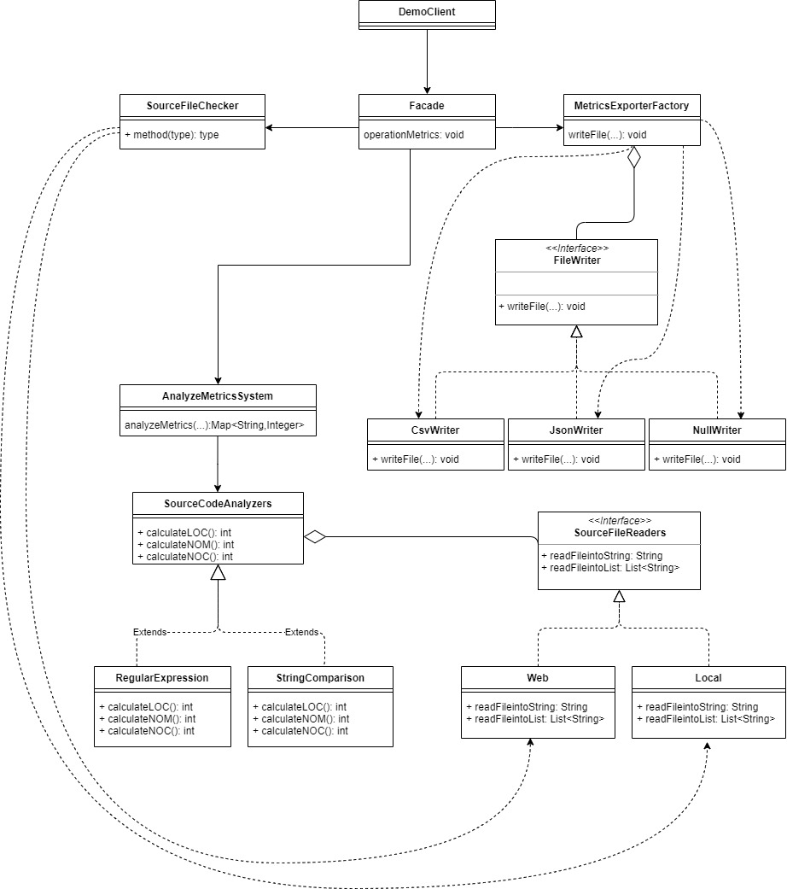

# 3rd Assignment: DesignPatterns

The executable .jar takes 5 arguments:
1. arg[0] = Java Source Code Input file (e.g., src/test/resources/TestClass.java)
2. arg[1] = Source Code Analyzer Type [regex|strcomp]
3. arg[2] = Source Code Location Type [local|web]
4. arg[3] = Output File Path (e.g., ../output_metrics_file)
5. arg[4] = Output File Type [csv|json]

### What is the function
1. It reads the file IF the path is valid
2. It checks if the file is stored localy, or in web (in other words, the location of the file)
3. It analyzes 3 metrics (LOC = lines of code, NOM = number of methods & NOC = number of classes) with the use of the given code analyzer (regex or strcomp)
4. It exports (writes) the file as the given file type (csv).

### Prerequisites
1. A java file.

After you have built the project following the [steps](https://github.com/LoukasPap/seipCourse_2020/blob/development/README.md) in the first README.md, continue below to run the module.

### How to run
java -jar <path of jar> <filepath> <source code analyzer> <source code location> <output filepath> <output file type>

where _path of jar_ is something like .../sourcecodeanalyzer/target/sourcecodeanalyzer-0.0.1-SNAPSHOT-jar-with-dependencies.jar,
_filepath_ is something like .../sourcecodeanalyzer/src/main/resources/TestClass.java,
_source code analyzer_ is **regex** or **strcomp**,
_source code location_ is **local** or **web**,
_output filepath_ is something like .../sourcecodeanalyzer/src/main/resources/outputs
and _output file type_ is **csv**

## About the DesignPatterns
1. Which patterns do I use
   In my code, the design patterns I use are Facade, Bridge, Null Object and Factory (as a result I use Strategy Pattern too).

2. Why I selected these patterns/how do they affect my system
   I selected these patterns because the offer flexibility, extensibility, simplification in main class and separation of concerns.

3. What are the drawbacks
   Even if these patterns help a lot, they have negatives in other things. As a result of their use, I created a lot more classes, so the system became more complex, and also they fill more space in the memory. In addition to that, hey need more time to be understood and maintained.

4. Which classes participate in each patterns
   * Facade pattern: _Facade_ class as the class that de-couples the
     subsystem for the _DemoClient_ class.
   * Bridge pattern: _AnalyzeMetricsSystem_ is the basic class that handles
     the calculation of the metrics, _RegularExpressions_ & _StringComparison_ classes as source code analyzers that extend the _SourceCodeAnalyzer_ class, _Web_ and _Local_  as the source file readers that implement the interface _SourceFileReaders_ .
   * Factory & Null Object pattern: _CsvWriter_, _JsonWriter_ & _NullWriter_ are the
     classes that implement the interface _FileWriter_, and are handle by the basic class of this pattern _MetricsExporterFactory_.

## UML diagram


## Test project
To simply run all the unit tests, execute from command line
`mvn test`

## Generate Test-coverage report
To simply run the unit tests of the project, with jacoco report, execute the following Maven command:
```
mvn test jacoco:report
```
